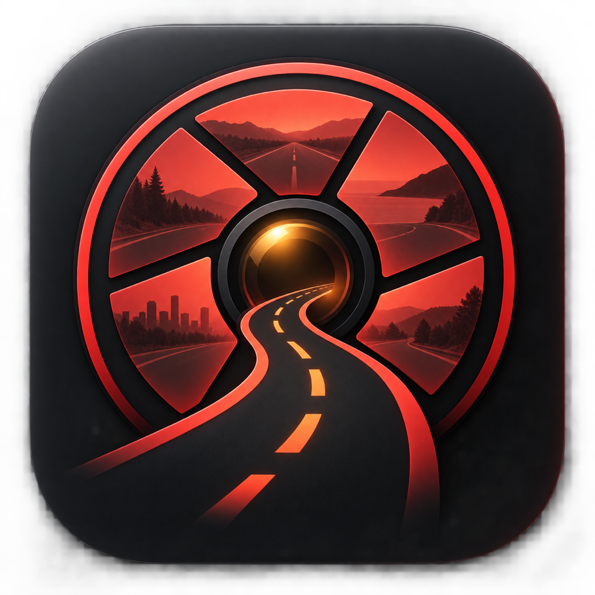

<p align="center">
  
</p>

<h1 align="center">RoadReel</h1>

<p align="center">
  A polished, local-first macOS viewer for TeslaCam recordings.<br>
  面向 TeslaCam 行车记录仪文件的现代 macOS 本地播放器。
</p>

<p align="center">
  <a href="https://github.com/Dynmi/RoadReel/releases/latest">Download</a> ·
  <a href="#中文">中文</a> ·
  <a href="#english">English</a>
</p>

## 中文

RoadReel 会直接读取 U 盘或本地目录中的 `TeslaCam` 文件夹，不上传视频、不要求登录，也不依赖云服务。

### 功能

- 最近录像、已保存录像、哨兵录像自动分类
- 前视、后视、左右侧、左右 B 柱共六路视频同步播放
- 单击小画面切换主视角，双击主画面进入全屏
- 缩略图、录像搜索、时间排序和键盘切换
- 时间轴显示事件点与视频分段边界
- 0.5×–2× 变速、静音、前后 10 秒、前后分段跳转
- 右键任意视角，可导出完整视频或当前时间前后 30 秒
- 删除录像时移入 macOS 废纸篓，可在清空前恢复
- 中文 / English 双语界面，首次打开时选择语言
- Apple 芯片与 Intel Mac 通用构建，支持 macOS 14 及以上版本

### 安装

1. 在 [Releases](https://github.com/Dynmi/RoadReel/releases/latest) 下载最新的 `RoadReel-*.dmg`。
2. 打开 DMG，将 RoadReel 拖到“应用程序”。
3. 首次启动时右键 RoadReel 并选择“打开”。如果系统仍拦截，请前往“系统设置 → 隐私与安全性”，点击“仍要打开”。

当前公开构建采用临时签名，尚未经过 Apple 公证，因此首次启动会出现一次 Gatekeeper 提示。源码和构建流程均在本仓库中，可自行审查或编译。

### 车辆遥测说明

TeslaCam U 盘视频与事件 JSON 通常不包含车速、方向盘角度、刹车或电门数据。车机内置播放器可访问车辆内部数据，但这些数据不会随标准 U 盘录像一同导出，因此 RoadReel 不会伪造或推测这些数值。

## English

RoadReel reads a `TeslaCam` folder directly from a USB drive or local disk. Videos stay on your Mac: there is no account, upload, analytics SDK, or cloud dependency.

### Highlights

- Automatically groups Recent, Saved, and Sentry recordings
- Synchronized playback across front, rear, side, and B-pillar cameras
- Click a camera tile to make it primary; double-click the main video for full screen
- Thumbnails, search, chronological sorting, and keyboard navigation
- Event and segment markers on the timeline
- 0.5×–2× playback, mute, ±10-second seeking, and segment navigation
- Context-menu export for a full camera view or a ±30-second excerpt
- Safe deletion through macOS Trash
- Chinese and English interface
- Universal Apple silicon and Intel build for macOS 14+

### Install

1. Download the latest `RoadReel-*.dmg` from [Releases](https://github.com/Dynmi/RoadReel/releases/latest).
2. Open the DMG and drag RoadReel to Applications.
3. On first launch, Control-click RoadReel and choose **Open**. If macOS still blocks it, use **System Settings → Privacy & Security → Open Anyway**.

Public builds are currently ad-hoc signed and not Apple-notarized, so Gatekeeper displays a one-time warning. The complete source and reproducible packaging script are available here for inspection.

### Vehicle telemetry

Standard TeslaCam USB video and event JSON files generally do not contain speed, steering angle, brake, or accelerator values. The in-car viewer can access internal vehicle data that is not exported with the USB recordings, so RoadReel does not invent or estimate it.

## Build from source

Requirements: macOS 14+, Xcode 16 or newer.

```bash
git clone https://github.com/Dynmi/RoadReel.git
cd RoadReel
open RoadReel.xcodeproj
```

To produce a universal ZIP, DMG, and SHA-256 checksums locally:

```bash
./scripts/build-release.sh
```

Artifacts are written to `release/`.

## Privacy and security

RoadReel runs locally and makes no network requests. See [PRIVACY.md](PRIVACY.md) and [SECURITY.md](SECURITY.md).

## Contributing

Issues and pull requests are welcome. Please read [CONTRIBUTING.md](CONTRIBUTING.md) before submitting a change.

## Trademark notice

RoadReel is an independent community project and is not affiliated with, endorsed by, or sponsored by Tesla, Inc. Tesla and TeslaCam are trademarks of their respective owner and are used only to describe file-format compatibility.

## License

[MIT](LICENSE)
