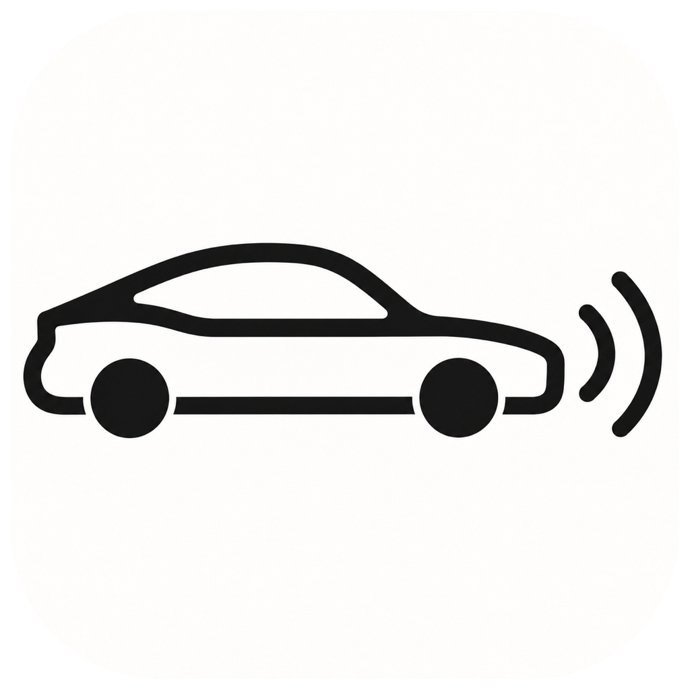
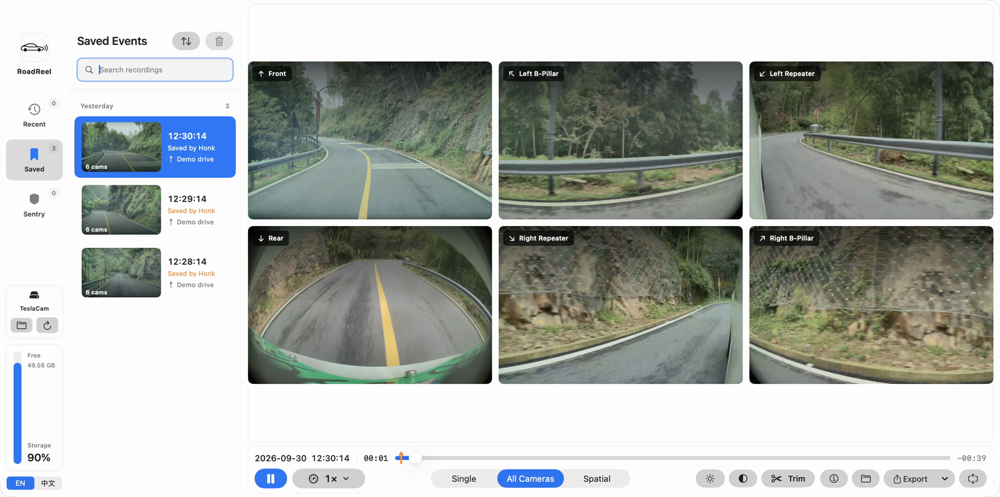
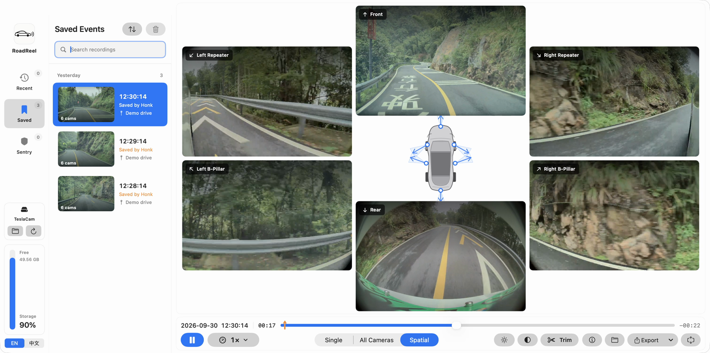

<p align="center">
  
</p>

<h1 align="center">RoadReel</h1>

<p align="center">
  A polished, local-first macOS viewer for TeslaCam recordings.
</p>

<p align="center">
  <a href="https://github.com/Dynmi/RoadReel/releases/latest">Download</a> ·
  <a href="#overview">English</a> ·
  <a href="#简体中文">简体中文</a>
</p>

## Overview

RoadReel reads a `TeslaCam` folder directly from a USB drive or local disk. Videos stay on your Mac: there is no account, upload, analytics SDK, or cloud dependency.

<p align="center">
  
</p>

The screenshot uses anonymized sample location metadata; the source videos are not part of this repository.

## Features

- Automatically discover TeslaCam USB drives at launch and when connected; restore authorized folders and reload after reconnecting
- Browse Recent, Saved, and Sentry recordings with larger thumbnails, search, and chronological sorting
- Play up to six cameras on one synchronized timeline in Single, All Cameras, or Spatial view
- See every camera's complete frame at its original aspect ratio; zoom and pan in Single view or double-click for full-screen playback
- Follow event and segment markers, with an amber highlight for the event camera when it can be identified
- Review footage at 0.5×–8× speed from compact playback controls
- Adjust brightness and contrast for playback, including paused frames, without changing the recordings or exports
- Easily export a camera's complete recording or a ±30-second MP4 excerpt from the Export menu or camera context menu
- Trim all cameras together with timeline handles and range preview. Trim & Replace keeps the project name and TeslaCam folder structure, processes up to six cameras in parallel, verifies the result, and moves the original to Trash
- Native macOS controls on a white workspace, with English by default and Simplified Chinese available in the sidebar
- Universal Apple silicon and Intel build for macOS 14+
- GitHub project link and automatic update checks, with one-click signed updates from the sidebar

<p align="center">
  
</p>

## Installation

1. Download the latest `RoadReel-*.dmg` from [Releases](https://github.com/Dynmi/RoadReel/releases/latest).
2. Open the DMG and drag RoadReel to Applications.
3. On first launch, Control-click RoadReel and choose **Open**. If macOS still blocks it, use **System Settings → Privacy & Security → Open Anyway**.

Public builds are currently ad-hoc signed and not Apple-notarized, so Gatekeeper displays a one-time warning. The complete source and reproducible packaging script are available here for inspection.

## Vehicle telemetry

Standard TeslaCam USB video and event JSON files generally do not contain speed, steering angle, brake, or accelerator values. The in-car viewer can access internal vehicle data that is not exported with the USB recordings, so RoadReel does not invent or estimate it.

## Build from source

Requirements: macOS 14+, Xcode 16 or newer.

```bash
git clone https://github.com/Dynmi/RoadReel.git
cd RoadReel
open RoadReel.xcodeproj
```

To produce a universal DMG and signed update feed locally:

```bash
./scripts/build-release.sh
```

Artifacts are written to `release/`. Publishing updates requires the existing RoadReel signing key; see [update packaging](docs/updates.md). Ordinary Xcode builds do not need that private key.

## Privacy and security

Recordings stay on your Mac. RoadReel contacts GitHub to check for updates and downloads an update only after you click Update. See [PRIVACY.md](PRIVACY.md) and [SECURITY.md](SECURITY.md).

## Contributing

Issues and pull requests are welcome. Please read [CONTRIBUTING.md](CONTRIBUTING.md) before submitting a change.

## Trademark notice

RoadReel is an independent community project and is not affiliated with, endorsed by, or sponsored by Tesla, Inc. Tesla and TeslaCam are trademarks of their respective owner and are used only to describe file-format compatibility.

## 简体中文

RoadReel 是一款现代化的 macOS 本地播放器，可直接读取 U 盘或本地目录中的 `TeslaCam` 文件夹。视频不会上传，无需登录，也不依赖云服务。

### 主要功能

- 启动和插入 U 盘时自动发现 TeslaCam 录像，恢复已授权目录，重新连接后自动加载
- 分类浏览最近录像、已保存录像和哨兵录像，支持大缩略图、搜索和时间排序
- 六路摄像头共享一个同步时间轴，可切换 Single、All Cameras 和 Spatial 视图
- 按原始比例完整显示画面；单镜头支持缩放、拖动查看细节和双击全屏
- 时间轴显示事件点与分段标记，能可靠识别时用琥珀色突出事件镜头
- 支持 0.5×–8× 倍速播放
- 可调整播放画面的亮度和对比度，包括暂停画面；不改变源文件或导出视频
- 通过 Export 菜单或摄像头右键菜单，便捷导出单机位完整录像或当前时间前后各 30 秒的 MP4 片段
- 拖动时间轴两端选择保留范围并预览，最多六路并行截取；保留同名项目和 TeslaCam 目录结构，验证成功后替换，原项目移到废纸篓
- 白色工作区与 macOS 原生控件，默认英语，侧栏可切换简体中文
- 支持 macOS 14 及以上版本，以及 Apple 芯片和 Intel Mac
- 内置 GitHub 项目入口与自动更新检查，侧栏深黄色按钮可一键下载、验证并重启更新

### 安装

1. 在 [Releases](https://github.com/Dynmi/RoadReel/releases/latest) 下载最新的 `RoadReel-*.dmg`。
2. 打开 DMG，将 RoadReel 拖入“应用程序”。
3. 首次启动时右键 RoadReel 并选择“打开”。如果系统仍然拦截，请前往“系统设置 → 隐私与安全性”，点击“仍要打开”。

当前公开构建采用临时签名，尚未经过 Apple 公证，因此首次启动会出现一次 Gatekeeper 提示。源码与可复现的打包脚本均已公开，可自行审查或编译。

### 车辆遥测说明

标准 TeslaCam U 盘视频与事件 JSON 通常不包含车速、方向盘角度、刹车或电门数据。车机内置播放器可以访问未随 U 盘录像导出的车辆内部数据，因此 RoadReel 不会伪造或推测这些数值。

## License

[MIT](LICENSE)
